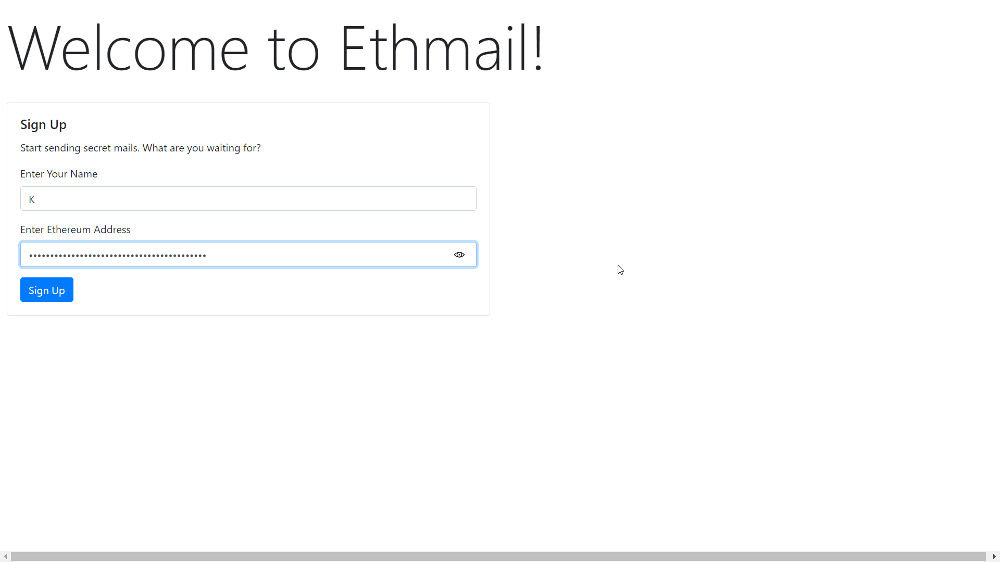
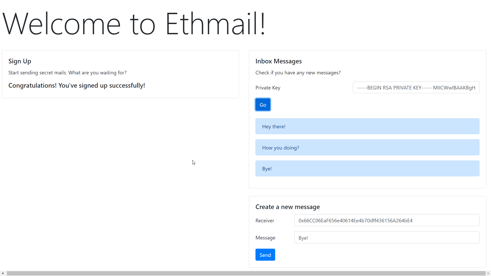

# Ethmail
A de-centralized mailing app using Embark framework.

The goal of Ethmail is to send encrypted emails on the blockchain using public key encryption. All encryption and decryption is done client side, with smart contracts used to manage ownership. There are features built into the contract not yet implemented by the client, although at some point I do envision a version two of the contract.

To Use: Visit the site using Metamask.

To Build: Install embark and run 'embark run' to build and deploy.

A few things you need to know, in order to get started with the tutorial:-
* Ethcode/Etheratom
* Embark
* Metamask

### Setting up Ethmail
* Create your Metamask account
* Get your private key from Metamask and replace the `privateKey` inside ethmail/config/contracts.js 
* Setup embark and run `embark run` inside the ethmail folder






## Getting started with Embark
Embark is a framework that allows you to easily develop and deploy Decentralized Applications (DApps).
A Decentralized Application is a serverless html5 application that uses one or more decentralized technologies.
Embark currently integrates with EVM blockchains (Ethereum), Decentralized Storages (IPFS), and Decentralized communication platforms (Whisper and Orbit). Swarm is supported for deployment.

```Bash
$ npm -g install embark
```
For more information on Embark tutorial and demonstration, please go through the following links!

* [Getting started with Embark](https://ethereumdev.io/getting-started-with-embark-framework/)
* [Embark Framework Docs](https://embark.status.im/docs/)
[title](https://www.example.com)

## Diving into the Application
This project can be a great way to start your journey in building de-centralized applications. There are two smart-contracts which need to be discussed thoroughly:-

### 1.  MessageBoard

The purpose of this smart-contract is to store and retrieve the messages from the blockchain network. We need to compile this in Ethcode, and manually test it, before calling it from index.js!

```javascript
pragma solidity ^0.4.23;

contract MessageBoard {
    string[] public messages;
    uint public count;

    function writeMessage(string memory message) public {
      messages.push(message);
      count += 1;
    }


    function clearChats() public {
      delete messages;
    }
}
```


### 2. AccountBoard

This smart-contact is mainly targetting the storage of the public-key and other primary details regarding the user, (user-accounts) and saving the permanent details of the user in the blockchain, so that when Person A sends anything to Person B, it encrypts the message with the **Public Key of B**.

```javascript
pragma solidity ^0.4.23;

contract AccountBoard {
    struct Account {
      string publicKey;
      string name;
    }
    mapping (address => Account) public accounts;
    address[] public userAccounts;
    function setAccount(address _address, string _publicKey, string _name) {
      Account storage account;
      account.publicKey = _publicKey;
      account.name = _name;
      accounts[_address] = account;
      userAccounts.push(_address);
    }
    function getAccounts() public returns (address[]) {
      return userAccounts;
    }
    function getAccount(address acc) public returns (string) {
      return accounts[acc].publicKey;
    }
}
```

## Assymmetric Key Encryption
***What we are doing here?*** Suppose you want to send your friend César, we are ecrypting the message with his **public-key**, and once he retrieves the message from the blockchain, he has to decrypt it with his own **private-key**. Now there are two things to remember here:-
<br>
***1. The public-key of César is saved in the blockchain, and Ethmail is automaticaly fetching it!***
<br>
***2. While decrypting any message César has to use his own private-key which is why this is so secure! So even if someone gets hold of the message, he cannot understand it!***


We are using a JSEncrypt library to achieve this RSA encryption-decryption. For more information, visit here: <br>
https://travistidwell.com/jsencrypt/
